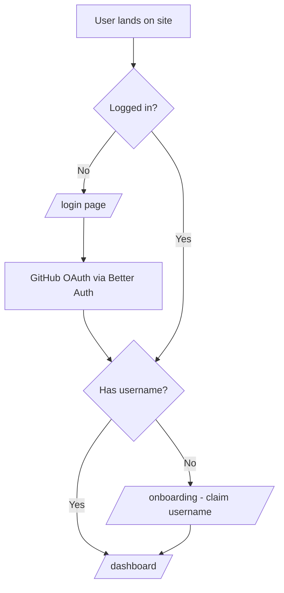

# Architecture

How the pieces fit together. Read this before writing code so the three of us stay on the same page.

---

## The big picture

DevFolio is a Next.js 16 App Router app with a single SQLite database behind it. Everything the user sees is either a server-rendered React Server Component or a client component mounted inside one. Data goes in through Server Actions and comes out through direct Drizzle queries in server components. We don't build our own REST API.

The two real HTTP endpoints we expose are the Better Auth catch-all at `/api/auth/[...all]` (because Better Auth needs it) and the OG image route at `/api/og/[username]` (because it has to return an image response to the browser). Everything else — every CRUD operation, every AI call, every link check — is a function call.

```mermaid
flowchart LR
  User[Browser] -->|visits /[username]| RSC[Public Profile RSC]
  RSC -->|drizzle query| DB[(SQLite / Turso)]

  User -->|submits form| SA[Server Action]
  SA -->|validate with zod| SA
  SA -->|drizzle write| DB
  SA -->|revalidatePath| RSC
```

---

## Reads

Any page that displays data — the public profile, the dashboard, the landing page's user count — reads from Drizzle directly inside an async server component. There is no `/api/profile/get` or similar. The server component awaits the query, and the HTML streams to the browser with the data already baked in.

This matters for two reasons. First, it's faster — one fewer network hop. Second, it keeps types honest. The component's props are the actual DB row shape, no DTO layer in between.

A public profile page looks roughly like this:

```ts
// app/[username]/page.tsx
import { notFound } from 'next/navigation';
import { db } from '@/db';
import { user } from '@/db/schema';
import { eq } from 'drizzle-orm';

export default async function ProfilePage({
  params
}: {
  params: Promise<{ username: string }>;
}) {
  const { username } = await params;

  const profile = await db.query.user.findFirst({
    where: eq(user.username, username),
    with: {
      profile: true,
      projects: true,
      skills: true,
      experience: true,
      socials: true
    }
  });

  if (!profile) notFound();

  return <PublicProfile user={profile} />;
}
```

A few things worth noting. `params` is a Promise in Next.js 15+ — always `await` it. The `<PublicProfile>` component itself can be a server component because it doesn't need interactivity; no client boundary needed for the public page at all.

---

## Writes

Every mutation goes through a Server Action in `server-actions/`. The pattern:

1. File starts with `'use server'`
2. Action takes a typed input
3. Input is parsed through a Zod schema from `schemas/`
4. Session is checked via Better Auth (who is logged in, do they own this resource)
5. Drizzle performs the write
6. `revalidatePath()` is called so the next render of the affected page sees the new data
7. Action returns either the new data or a typed error

Example shape:

```ts
// server-actions/projects.ts
'use server';

import { revalidatePath } from 'next/cache';
import { headers } from 'next/headers';
import { auth } from '@/lib/auth';
import { db } from '@/db';
import { projects } from '@/db/schema';
import { projectSchema } from '@/schemas/project';

export async function createProject(input: unknown) {
  const session = await auth.api.getSession({ headers: await headers() });
  if (!session?.user) throw new Error('Unauthorized');

  const data = projectSchema.parse(input);

  const [project] = await db
    .insert(projects)
    .values({ ...data, userId: session.user.id })
    .returning();

  revalidatePath('/dashboard/projects');
  if (session.user.username) {
    revalidatePath(`/${session.user.username}`);
  }

  return project;
}
```

The form component calls this action directly — no `fetch`, no React Query, no intermediate endpoint. React Hook Form hands the values to the action, the action runs on the server, and when it returns, the dashboard page re-renders with fresh data because `revalidatePath` invalidated the RSC cache.

---

## Client components

The default is server component. We only add `'use client'` when we genuinely need it:

- Forms (React Hook Form is a client library)
- Anything with `useState`, `useReducer`, `useEffect`, or event handlers that aren't form submissions
- Tanstack Query consumers
- Toggles, tabs, dialogs (shadcn primitives that use Radix)
- Anything that calls the Better Auth client (`authClient.signIn.social`, etc.)

Push the boundary as low as possible. If a dashboard page has a sidebar and a form, the page itself stays as a server component, the form is the client component, and the sidebar is imported directly. The page passes server-rendered pieces into the form as props or children — never the other way around.

A client component cannot import and render a server component. If a form needs to show server-rendered content inline, the server content comes in through `children`.

---

## Tanstack Query, narrowly

We use Tanstack Query for a specific set of cases, not as a general data layer. It's for things where:

- The call is triggered by a user action mid-page (not on navigation)
- You need loading state, error state, and retry
- You don't want to revalidate the whole route

That's mostly the AI-assist features and the broken link checker. The user clicks "Improve description," we call a server action through `useMutation`, show a spinner on the button, and when the response arrives we drop the result into the form field via `setValue`.

`QueryClientProvider` lives in `app/providers.tsx`:

```ts
// app/providers.tsx
'use client';

import { QueryClient, QueryClientProvider } from '@tanstack/react-query';
import { useState } from 'react';

export function Providers({ children }: { children: React.ReactNode }) {
  const [client] = useState(() => new QueryClient());
  return <QueryClientProvider client={client}>{children}</QueryClientProvider>;
}
```

And wraps `{children}` inside the root layout. Custom hooks (`useImproveDescriptionMutation`, `useCheckLinksMutation`, etc.) live in `hooks/`.

---

## Caching and revalidation

Next.js has several caching layers and they interact in ways that bite. A quick summary of what matters for us:

**Request memoization** — `fetch` and functions wrapped in `cache()` are deduplicated within a single render. If the profile page and a component inside it both query the same user, Drizzle runs once. We don't need to do anything special for this to work.

**Data cache** — caches the results of `fetch` calls across requests. We don't use `fetch` for our own data (we use Drizzle), so this mostly doesn't apply. It would apply if we started hitting an external API.

**Full route cache** — server-rendered HTML and RSC payload cached on the server. Note that Next.js 15 changed the defaults: fetches and GET route handlers are no longer cached by default. Pages are still eligible for static rendering if they don't use dynamic APIs (cookies, headers, searchParams) — the public profile page uses the username param, so it's dynamic.

**Router cache** — client-side, in-memory. When you navigate between pages in the app, Next.js keeps the RSC payloads around so going back is instant. Next.js 15 also reduced the default `staleTimes` for this cache, which helps avoid the most common "I just created something and it's not showing up" trap.

Even with the saner defaults, our rule stays: **every server action that writes to the DB calls `revalidatePath` for every page that might display that data**. For projects, that's `/dashboard/projects` and `/[username]`. For profile edits, that's `/dashboard/profile` and `/[username]`. Worth the two extra lines.

---

## Auth flow



Better Auth handles the OAuth dance. The config lives in `lib/auth.ts`:

```ts
// lib/auth.ts
import { betterAuth } from 'better-auth';
import { drizzleAdapter } from 'better-auth/adapters/drizzle';
import { db } from '@/db';
import * as schema from '@/db/schema';

export const auth = betterAuth({
  database: drizzleAdapter(db, {
    provider: 'sqlite',
    schema
  }),
  socialProviders: {
    github: {
      clientId: process.env.GITHUB_CLIENT_ID!,
      clientSecret: process.env.GITHUB_CLIENT_SECRET!
    }
  },
  user: {
    additionalFields: {
      username: { type: 'string', required: false, unique: true }
    }
  }
});
```

The route handler is a thin catch-all:

```ts
// app/api/auth/[...all]/route.ts
import { toNextJsHandler } from 'better-auth/next-js';
import { auth } from '@/lib/auth';

export const { GET, POST } = toNextJsHandler(auth.handler);
```

For the client side (sign-in buttons, logout), we have a matching `authClient`:

```ts
// lib/auth-client.ts
import { createAuthClient } from 'better-auth/react';

export const authClient = createAuthClient({
  baseURL: process.env.NEXT_PUBLIC_BETTER_AUTH_URL
});
```

On the server — in server components and server actions — get the session with `auth.api.getSession({ headers: await headers() })`. On the client, use the `authClient.useSession()` hook.

After a successful GitHub login, Better Auth creates or updates the user row. On the first login, our custom `username` field is null. The dashboard layout checks for this and redirects to `/onboarding`. The onboarding page is a server component with a single client form that calls `claimUsername()` — a server action that validates the string, checks uniqueness, updates the user row, and redirects to `/dashboard/profile`.

Protected routes check the session in the layout or page. If there's no session, redirect to `/login`. Server actions check independently — never trust that the caller was on a protected page.

---

## Two request lifecycles, end to end

### Visiting a public profile

1. User's browser requests `GET /jakub`
2. Next.js matches the `[username]` dynamic route, invokes `page.tsx` as an async server component
3. `generateMetadata` runs, awaits `params`, queries the user by username for the title and OG image URL, returns metadata for the `<head>`
4. The page component runs, awaits `params`, Drizzle fetches the user with all their relations
5. If not found, `notFound()` renders `not-found.tsx`
6. Otherwise, the `<PublicProfile>` tree renders to HTML on the server
7. HTML streams to the browser, `<head>` includes OG tags pointing at `/api/og/jakub`
8. When someone shares the link, the social platform scrapes the OG image URL, which hits the `/api/og/[username]` route — that route is a separate request, generates a PNG via `next/og` `ImageResponse`, and returns it

### Saving a project edit from the dashboard

1. User edits the form, clicks save
2. React Hook Form validates against the Zod schema on the client. If it fails, the server is never hit
3. On success, the form handler calls `await updateProject(values)` — a server action
4. The action runs on the server. Parses the input through the same Zod schema. Calls `auth.api.getSession()` to get the logged-in user. Checks that the user owns the project. Writes to the DB. Calls `revalidatePath('/dashboard/projects')` and `revalidatePath('/[username]')`.
5. Action returns the updated project
6. The client form shows a toast and optionally resets
7. When the user navigates back to the projects list, Next.js sees the router cache is stale, fetches the fresh RSC payload, and the list shows the update

No `fetch`, no intermediate API, no manual refetch. The server action is the whole pipeline.

---

## Environment boundaries

Things that only exist server-side:

- Drizzle client (`db/index.ts`)
- Server action files (`server-actions/*`)
- Better Auth server config (`lib/auth.ts`)
- OG image route
- Anthropic SDK calls (only from inside server actions)

Things that can run either side:

- Zod schemas (`schemas/*`)
- Shared types (`types/*`)
- Pure utility functions (`lib/utils.ts`)

Things that only run client-side:

- `'use client'` components
- Tanstack Query hooks (`hooks/*`)
- Better Auth client (`lib/auth-client.ts`)
- Anything using the `window` object

Rule of thumb: if you need the secret, it goes server-only. The `ANTHROPIC_API_KEY`, `BETTER_AUTH_SECRET`, `GITHUB_CLIENT_SECRET`, and `AUTH_TOKEN` never touch a client bundle — they're read from `process.env` inside server-only code.

---

## Styling & design system

The visual layer is governed by [`docs/design_handoff_devfolio/`](./design_handoff_devfolio/). That folder is the source of truth — tokens, component inventory, layout patterns, voice rules, and an interactive HTML preview at `preview/design-system.html`.

`app/globals.css` is the production token sheet, copied verbatim from the handoff. It exposes:

- **DevFolio raw tokens** — `--paper`, `--paper-2`, `--paper-3`, `--ink`, `--ink-2`, `--ink-3`, `--hairline`, `--accent`, `--danger`, `--warn`; spacing on a 4pt grid; the type scale `--t-xs … --t-5xl`; radii `--radius-xs … --radius-xl`.
- **shadcn aliases** — `--background`, `--foreground`, `--card`, `--primary`, `--border`, `--ring`, etc., mapped onto the raw tokens. Every shadcn primitive picks the look up automatically; we don't customize their internals.
- **Tailwind v4 `@theme inline` bridge** — exposes the same variables as utilities (`bg-card`, `text-muted-foreground`, `font-mono`, `rounded-md`, etc.).

Themes are scoped via `[data-theme="dark"]` (default) and `[data-theme="light"]` on `<html>`. Switching is a single attribute swap — no re-render, no flash. Fonts are Geist + Geist Mono via `next/font/google`; the variables `--font-geist-sans` / `--font-geist-mono` are wired into `--font-sans` / `--font-mono` in `globals.css`.

Practical rule: never hardcode hex. Either use a Tailwind utility (`bg-background`, `text-muted-foreground`) or reference the raw token (`text-[var(--ink-3)]`, `bg-[var(--paper-2)]`) when no alias fits.